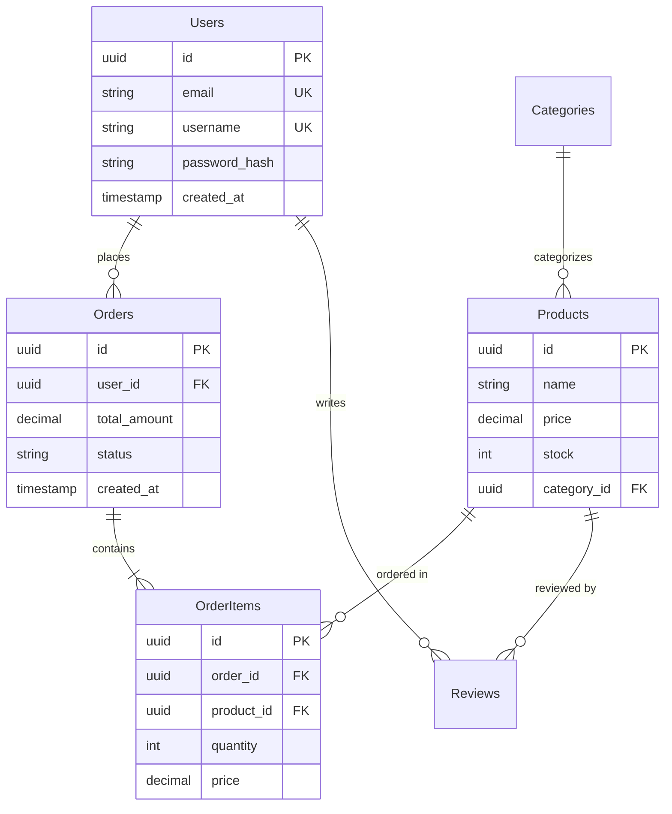

# Examples for Database Schema Design

## Input Format Examples

### Typical User Request
```text
전자상거래 플랫폼의 데이터베이스를 설계해줘:
- DB: PostgreSQL
- 엔티티: User(사용자), Product(상품), Order(주문), Review(리뷰)
- 관계:
  - User는 여러 Order를 가질 수 있음
  - Order는 여러 Product를 포함 (N:M)
  - Review는 User와 Product에 연결
- 예상 데이터: 10만 사용자, 1만 상품
- 읽기 중심 (상품 조회 빈번)
```

## Procedure Examples

### 1. Entity Definition Example (E-commerce)
```text
Users (사용자)
- id: UUID PRIMARY KEY
- email: VARCHAR(255) UNIQUE NOT NULL
- username: VARCHAR(50) UNIQUE NOT NULL
- password_hash: VARCHAR(255) NOT NULL
- created_at: TIMESTAMP DEFAULT NOW()
- updated_at: TIMESTAMP DEFAULT NOW()

Products (상품)
- id: UUID PRIMARY KEY
- name: VARCHAR(255) NOT NULL
- description: TEXT
- price: DECIMAL(10, 2) NOT NULL
- stock: INTEGER DEFAULT 0
- category_id: UUID REFERENCES Categories(id)
- created_at: TIMESTAMP DEFAULT NOW()

Orders (주문)
- id: UUID PRIMARY KEY
- user_id: UUID REFERENCES Users(id)
- total_amount: DECIMAL(10, 2) NOT NULL
- status: VARCHAR(20) DEFAULT 'pending'
- created_at: TIMESTAMP DEFAULT NOW()

OrderItems (주문 상품 - 중간 테이블)
- id: UUID PRIMARY KEY
- order_id: UUID REFERENCES Orders(id) ON DELETE CASCADE
- product_id: UUID REFERENCES Products(id)
- quantity: INTEGER NOT NULL
- price: DECIMAL(10, 2) NOT NULL
```

### 2. Relationship & Normalization (Mermaid ERD)


### 3. Index Strategy (PostgreSQL)
```sql
-- Primary Keys (자동 인덱스)
CREATE TABLE users (
    id UUID PRIMARY KEY DEFAULT gen_random_uuid(),
    email VARCHAR(255) UNIQUE NOT NULL,
    username VARCHAR(50) UNIQUE NOT NULL,
    password_hash VARCHAR(255) NOT NULL,
    created_at TIMESTAMP DEFAULT NOW(),
    updated_at TIMESTAMP DEFAULT NOW()
);

-- Foreign Keys + 명시적 인덱스
CREATE TABLE orders (
    id UUID PRIMARY KEY DEFAULT gen_random_uuid(),
    user_id UUID NOT NULL REFERENCES users(id) ON DELETE CASCADE,
    total_amount DECIMAL(10, 2) NOT NULL,
    status VARCHAR(20) DEFAULT 'pending',
    created_at TIMESTAMP DEFAULT NOW()
);

CREATE INDEX idx_orders_user_id ON orders(user_id);
CREATE INDEX idx_orders_status ON orders(status);
CREATE INDEX idx_orders_created_at ON orders(created_at);

-- 복합 인덱스
CREATE INDEX idx_orders_status_created ON orders(status, created_at DESC);

-- Products 테이블
CREATE TABLE products (
    id UUID PRIMARY KEY DEFAULT gen_random_uuid(),
    name VARCHAR(255) NOT NULL,
    description TEXT,
    price DECIMAL(10, 2) NOT NULL CHECK (price >= 0),
    stock INTEGER DEFAULT 0 CHECK (stock >= 0),
    category_id UUID REFERENCES categories(id),
    created_at TIMESTAMP DEFAULT NOW()
);

CREATE INDEX idx_products_category ON products(category_id);
CREATE INDEX idx_products_price ON products(price);
CREATE INDEX idx_products_name ON products(name);
```

### 4. Constraints & Triggers
```sql
CREATE TABLE products (
    id UUID PRIMARY KEY DEFAULT gen_random_uuid(),
    name VARCHAR(255) NOT NULL,
    price DECIMAL(10, 2) NOT NULL CHECK (price >= 0),
    stock INTEGER DEFAULT 0 CHECK (stock >= 0),
    discount_percent INTEGER CHECK (discount_percent >= 0 AND discount_percent <= 100),
    category_id UUID REFERENCES categories(id) ON DELETE SET NULL,
    created_at TIMESTAMP DEFAULT NOW(),
    updated_at TIMESTAMP DEFAULT NOW()
);

-- Trigger: updated_at 자동 갱신
CREATE OR REPLACE FUNCTION update_updated_at_column()
RETURNS TRIGGER AS $$
BEGIN
    NEW.updated_at = NOW();
    RETURN NEW;
END;
$$ LANGUAGE plpgsql;

CREATE TRIGGER update_products_updated_at
BEFORE UPDATE ON products
FOR EACH ROW
EXECUTE FUNCTION update_updated_at_column();
```

### 5. Migration Scripts
```sql
-- migrations/001_create_initial_schema.up.sql
BEGIN;

CREATE EXTENSION IF NOT EXISTS "uuid-ossp";

CREATE TABLE users (
    id UUID PRIMARY KEY DEFAULT gen_random_uuid(),
    email VARCHAR(255) UNIQUE NOT NULL,
    username VARCHAR(50) UNIQUE NOT NULL,
    password_hash VARCHAR(255) NOT NULL,
    created_at TIMESTAMP DEFAULT NOW(),
    updated_at TIMESTAMP DEFAULT NOW()
);

CREATE TABLE categories (
    id UUID PRIMARY KEY DEFAULT gen_random_uuid(),
    name VARCHAR(100) UNIQUE NOT NULL,
    parent_id UUID REFERENCES categories(id)
);

CREATE TABLE products (
    id UUID PRIMARY KEY DEFAULT gen_random_uuid(),
    name VARCHAR(255) NOT NULL,
    description TEXT,
    price DECIMAL(10, 2) NOT NULL CHECK (price >= 0),
    stock INTEGER DEFAULT 0 CHECK (stock >= 0),
    category_id UUID REFERENCES categories(id),
    created_at TIMESTAMP DEFAULT NOW(),
    updated_at TIMESTAMP DEFAULT NOW()
);

CREATE INDEX idx_products_category ON products(category_id);
CREATE INDEX idx_products_price ON products(price);

COMMIT;

-- migrations/001_create_initial_schema.down.sql
BEGIN;

DROP TABLE IF EXISTS products CASCADE;
DROP TABLE IF EXISTS categories CASCADE;
DROP TABLE IF EXISTS users CASCADE;

COMMIT;
```

## Output Format Examples

### File Structure
```text
프로젝트/
├── database/
│   ├── schema.sql
│   ├── migrations/
│   │   ├── 001_create_users.up.sql
│   │   ├── 001_create_users.down.sql
│   │   ├── 002_create_products.up.sql
│   │   └── 002_create_products.down.sql
│   ├── seeds/
│   │   └── sample_data.sql
│   └── docs/
│       ├── ERD.md
│       └── SCHEMA.md
└── README.md
```

## Usage Case Examples

### Example 1: Blog Platform (PostgreSQL)
```sql
CREATE TABLE users (
    id UUID PRIMARY KEY DEFAULT gen_random_uuid(),
    email VARCHAR(255) UNIQUE NOT NULL,
    username VARCHAR(50) UNIQUE NOT NULL,
    bio TEXT,
    avatar_url VARCHAR(500),
    created_at TIMESTAMP DEFAULT NOW()
);

CREATE TABLE posts (
    id UUID PRIMARY KEY DEFAULT gen_random_uuid(),
    author_id UUID NOT NULL REFERENCES users(id) ON DELETE CASCADE,
    title VARCHAR(255) NOT NULL,
    slug VARCHAR(255) UNIQUE NOT NULL,
    content TEXT NOT NULL,
    published_at TIMESTAMP,
    created_at TIMESTAMP DEFAULT NOW(),
    updated_at TIMESTAMP DEFAULT NOW()
);

CREATE INDEX idx_posts_author ON posts(author_id);
CREATE INDEX idx_posts_published ON posts(published_at);
CREATE INDEX idx_posts_slug ON posts(slug);
```

### Example 2: Real-time Chat (MongoDB)
```javascript
// users collection
{
  _id: ObjectId,
  username: String,
  email: String,
  avatar_url: String,
  status: String,
  last_seen: Date,
  created_at: Date
}

// conversations collection
{
  _id: ObjectId,
  participants: [
    {
      user_id: ObjectId,
      username: String,
      avatar_url: String
    }
  ],
  last_message: {
    content: String,
    sender_id: ObjectId,
    sent_at: Date
  },
  unread_counts: {
    "user_id_1": 5,
    "user_id_2": 0
  },
  created_at: Date,
  updated_at: Date
}

// messages collection
{
  _id: ObjectId,
  conversation_id: ObjectId,
  sender_id: ObjectId,
  content: String,
  attachments: [
    {
      type: String,
      url: String,
      filename: String
    }
  ],
  read_by: [ObjectId],
  sent_at: Date,
  edited_at: Date
}

// Indexes
db.users.createIndex({ username: 1 }, { unique: true });
db.users.createIndex({ email: 1 }, { unique: true });
db.conversations.createIndex({ "participants.user_id": 1 });
db.conversations.createIndex({ updated_at: -1 });
db.messages.createIndex({ conversation_id: 1, sent_at: -1 });
db.messages.createIndex({ sender_id: 1 });
```
