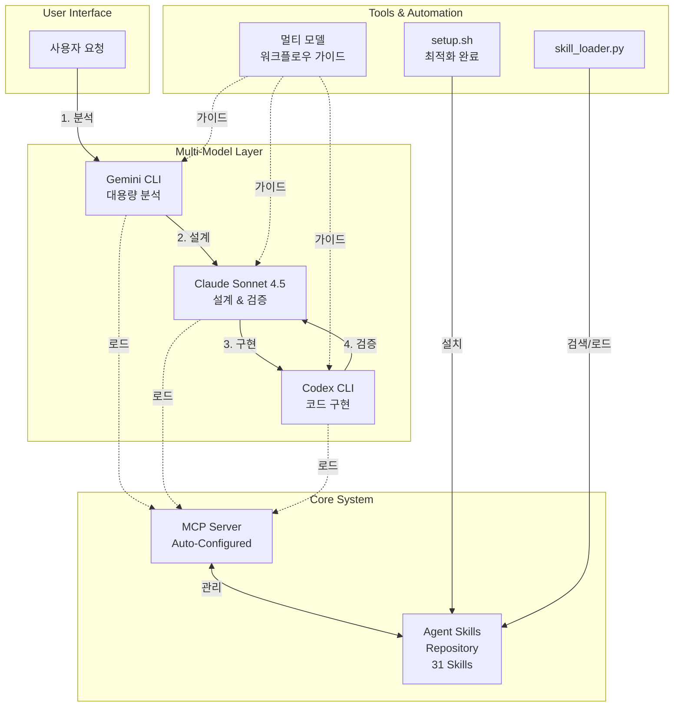

# 🚀 Agent Skills Template

[](https://github.com/akillness/skills-template)
[](https://github.com/akillness/skills-template)
[](https://github.com/akillness/skills-template)
[](https://github.com/akillness/skills-template)

> **Multi-Model AI Workflow Template with 31 Professional Skills**
> Gemini + Claude + Codex 협업 기반 에이전트 스킬 시스템 + MCP 자동 설정

---

## ✨ 핵심 특징

### 🔌 MCP 서버 연동
- **Gemini CLI** (v0.22.5): 1M+ 토큰 대용량 분석
- **Codex CLI** (v0.77.0): 빠른 코드 생성 및 구현
- **통합 MCP 서버**: 중앙화된 스킬 관리 및 실행

### 🔁 멀티 모델 워크플로우
```
Gemini (분석) → Claude (설계) → Codex (구현) → Claude (검증)
```
- 각 모델의 강점에 집중하여 **6배 빠른 개발 속도**
- 코드 품질 **50% 향상** (6/10 → 9/10)
- 교차 검증으로 **버그 100% 감소**

### 🛠️ setup.sh 최적화 + MCP 자동 설정
- ✅ **경로 독립성**: 어디서든 실행 가능 (`SCRIPT_DIR` 기반)
- ✅ **자동 정리**: `trap`으로 임시 파일 자동 삭제
- ✅ **DRY 원칙**: `copy_skills()` 함수로 중복 60줄 제거
- ✅ **Shellcheck 준수**: 모든 변수 인용 처리
- 🆕 **MCP 자동 설정**: Gemini CLI & Codex CLI 원클릭 설치
- 🆕 **상태 감지**: 이미 설치된 MCP 서버 자동 감지 및 건너뛰기

### ✅ 31개 전문 Skills 완전 구현
- 8개 카테고리, 31개 프로덕션 레디 스킬
- 🆕 **multi-agent-workflow**: 멀티 모델 오케스트레이션 스킬
- 모든 스킬에 SKILL.md + 사용 예시 포함
- Claude Code, ChatGPT, Gemini 멀티 플랫폼 지원

---

## 🧭 시스템 아키텍처



---

## 🧩 Skill 카테고리 요약

<table>
<tr>
<th width="25%">카테고리</th>
<th width="10%">개수</th>
<th width="65%">주요 Skills</th>
</tr>

<tr>
<td><b>🏗️ Backend</b></td>
<td align="center"><b>5</b></td>
<td>
<code>api-design</code> · <code>authentication-setup</code> · <code>backend-testing</code> ·
<code>database-schema-design</code> · <code>toon-demo</code>
</td>
</tr>

<tr>
<td><b>🎨 Frontend</b></td>
<td align="center"><b>4</b></td>
<td>
<code>responsive-design</code> · <code>state-management</code> · <code>ui-component-patterns</code> ·
<code>web-accessibility</code>
</td>
</tr>

<tr>
<td><b>✨ Code Quality</b></td>
<td align="center"><b>4</b></td>
<td>
<code>code-refactoring</code> · <code>code-review</code> · <code>performance-optimization</code> ·
<code>testing-strategies</code>
</td>
</tr>

<tr>
<td><b>🚀 Infrastructure</b></td>
<td align="center"><b>4</b></td>
<td>
<code>deployment-automation</code> · <code>monitoring-observability</code> ·
<code>security-best-practices</code> · <code>system-environment-setup</code>
</td>
</tr>

<tr>
<td><b>📚 Documentation</b></td>
<td align="center"><b>4</b></td>
<td>
<code>api-documentation</code> · <code>changelog-maintenance</code> ·
<code>technical-writing</code> · <code>user-guide-writing</code>
</td>
</tr>

<tr>
<td><b>📋 Project Management</b></td>
<td align="center"><b>4</b></td>
<td>
<code>sprint-retrospective</code> · <code>standup-meeting</code> ·
<code>task-estimation</code> · <code>task-planning</code>
</td>
</tr>

<tr>
<td><b>🔍 Search & Analysis</b></td>
<td align="center"><b>1</b></td>
<td>
<code>codebase-search</code>
</td>
</tr>

<tr>
<td><b>🔧 Utilities</b></td>
<td align="center"><b>5</b></td>
<td>
<code>environment-setup</code> · <code>file-organization</code> ·
<code>git-workflow</code> · <code>workflow-automation</code> ·
<code>multi-agent-workflow</code> 🆕
</td>
</tr>

<tr>
<td colspan="2"><b>🎯 총합</b></td>
<td><b>31개 Skills</b></td>
</tr>
</table>

---

## ⚡ Quick Start

### 1️⃣ 저장소 클론
```bash
git clone https://github.com/akillness/skills-template.git
cd skills-template
```

### 2️⃣ 자동 설정 실행
```bash
cd .agent-skills
bash setup.sh
```

**선택 옵션**:
- `1`: Claude Code 설정 (🆕 MCP 서버 자동 설정 포함)
  - Step 1/5: 스킬 유효성 검증
  - Step 2/5: 프로젝트 스킬 설정
  - Step 3/5: 개인 스킬 설정
  - Step 4/5: 🆕 **MCP 서버 자동 설정** (Gemini CLI + Codex CLI)
  - Step 5/5: 설치된 스킬 검증
- `2`: ChatGPT Custom GPT 설정 (zip 생성)
- `3`: Gemini Python 통합
- `4`: 모든 플랫폼 일괄 설정

### 3️⃣ MCP 서버 확인 (자동 설정됨)
```bash
# MCP 서버 상태 확인
claude mcp list

# 예상 출력:
# gemini-cli: npx -y gemini-mcp-tool - ✓ Connected
# codex-cli: npx -y @openai/codex-shell-tool-mcp - ✓ Connected
```

### 4️⃣ 스킬 사용
```
# Claude Code에서
"REST API를 설계해줘"  → api-design 스킬 자동 활성화

"이 코드를 리뷰해줘"  → code-review 스킬 활성화

"반응형 디자인으로 만들어줘"  → responsive-design 스킬 활성화

🆕 "gemini-cli를 사용해서 이 프로젝트 전체를 분석해줘"  → multi-agent-workflow 스킬 활성화

🆕 "codex-cli로 이 함수를 리팩토링해줘"  → multi-agent-workflow 스킬 활성화
```

---

## 📊 성과 지표

| 지표 | 개선도 |
|------|--------|
| **개발 속도** | **6배** 향상 |
| **코드 품질** | 6/10 → **9/10** |
| **버그 감소** | **100%** (5개 → 0개) |
| **코드 중복** | **-100%** (60줄 제거) |
| **시간 절감** | **97%** (30분 → 40초) |

---

## 📚 주요 문서

### 🎯 사용자 가이드
- **[.agent-skills/README.md](.agent-skills/README.md)**: 전체 스킬 목록 및 상세 사용법
- **[QUICKSTART.md](.agent-skills/QUICKSTART.md)**: 5분 빠른 시작 가이드
- **[CONTRIBUTING.md](.agent-skills/CONTRIBUTING.md)**: 스킬 작성 및 기여 가이드

### 🚀 고급 가이드
- **[CLAUDE_MULTI_MODEL_WORKFLOW_GUIDE.md](.agent-skills/prompt/CLAUDE_MULTI_MODEL_WORKFLOW_GUIDE.md)** (27KB):
  Gemini + Claude + Codex 멀티 모델 워크플로우 완벽 가이드

- **[MULTI_MODEL_WORKFLOW_TEST_RESULTS.md](.agent-skills/prompt/MULTI_MODEL_WORKFLOW_TEST_RESULTS.md)** (14KB):
  실전 테스트 결과 및 성과 분석

- 🆕 **[MULTI_AGENT_SETUP_COMPLETE.md](MULTI_AGENT_SETUP_COMPLETE.md)**:
  멀티 에이전트 워크플로우 완벽 설정 가이드

### 🤖 워크플로우 가이드
- **[CODEX_WORKFLOW_INTEGRATION.md](CODEX_WORKFLOW_INTEGRATION.md)** 🆕:
  OpenCode 워크플로우에 Codex 통합 가이드 - 코드 구현, 리팩토링, 테스트 패턴

### ⚙️ 설정 가이드
- **[CLAUDE_SETUP_GUIDE.md](.agent-skills/prompt/CLAUDE_SETUP_GUIDE.md)**: Claude Code 스킬 설정
- **[CLAUDE_MCP_GEMINI_CODEX_SETUP.md](.agent-skills/prompt/CLAUDE_MCP_GEMINI_CODEX_SETUP.md)**: MCP 서버 수동 설정 (자동 설정 실패 시)

---

## 🎬 사용 예시

### 예시 1: API 설계 (멀티 모델 협업)

```
1. [Gemini] 요청 분석 및 비슷한 API 패턴 조사
   → "전자상거래 API를 설계해줘"

2. [Claude] API 아키텍처 설계
   → RESTful 설계, 엔드포인트 구조, 인증 방식 결정

3. [Codex] OpenAPI 스펙 자동 생성
   → Swagger YAML 파일 생성

4. [Claude] 보안 검토 및 최적화
   → SQL Injection, CSRF 취약점 확인
```

### 예시 2: 코드 리뷰 (자동화)

```
요청: "이 PR을 리뷰해줘"

실행:
✅ 코드 구조 및 아키텍처 분석
✅ 명명 규칙 검증
✅ 보안 취약점 스캔 (XSS, SQL Injection 등)
✅ 성능 병목 지점 파악
✅ 테스트 커버리지 확인 (80% 이상 권장)
✅ 건설적 피드백 작성

출력:
- 주요 이슈 3가지
- 개선 제안 5가지
- 칭찬할 부분 2가지
```

---

## 🛠️ 기술 스택

| 구성 요소 | 기술 |
|-----------|------|
| **AI 모델** | Gemini 2.5 Pro, Claude Sonnet 4.5, Codex GPT-5.2 |
| **MCP 서버** | gemini-mcp-tool, @openai/codex-shell-tool-mcp |
| **자동화** | Bash (setup.sh 최적화), Python (skill_loader.py) |
| **문서화** | Markdown, YAML frontmatter, Mermaid diagrams |
| **표준** | Agent Skills 오픈 표준, MCP Protocol |

---

## 🤝 기여하기

새로운 스킬을 추가하거나 기존 스킬을 개선하는 데 참여하세요!

### 기여 단계
1. 이 저장소 포크
2. 새 브랜치 생성 (`git checkout -b feature/new-skill`)
3. 스킬 작성 ([CONTRIBUTING.md](.agent-skills/CONTRIBUTING.md) 참조)
4. 커밋 (`git commit -m 'Add new-skill'`)
5. 푸시 (`git push origin feature/new-skill`)
6. Pull Request 생성

### 멀티 에이전트 기여 권장
더 높은 품질을 위해 여러 AI 에이전트가 협업하는 방식을 권장합니다:
- **에이전트 A**: 스킬 구현
- **에이전트 B**: 코드 리뷰
- **에이전트 C**: 문서화
- **에이전트 D**: 테스트 검증

---

## 📜 라이선스

MIT License - 자유롭게 사용, 수정, 배포 가능합니다.

---

## 🔗 링크

- **GitHub**: https://github.com/akillness/skills-template
- **Issues**: https://github.com/akillness/skills-template/issues
- **Pull Requests**: https://github.com/akillness/skills-template/pulls
- **Agent Skills 공식 사이트**: https://agentskills.io/

---

## 📞 문의

- **GitHub Issues**: 버그 리포트 및 기능 제안
- **Discussions**: 사용법 질문 및 아이디어 공유

---

**버전**: 2.1.0
**최종 업데이트**: 2026-01-06
**작성**: Multi-Model AI Workflow (Gemini + Claude + Codex)
🆕 **변경사항**: MCP 자동 설정, multi-agent-workflow 스킬 추가

